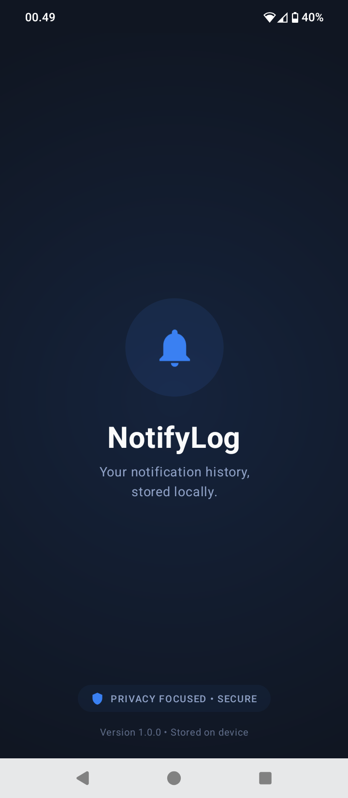
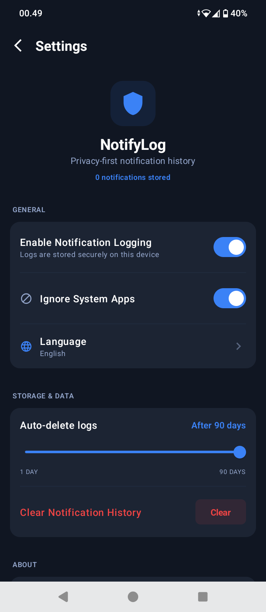
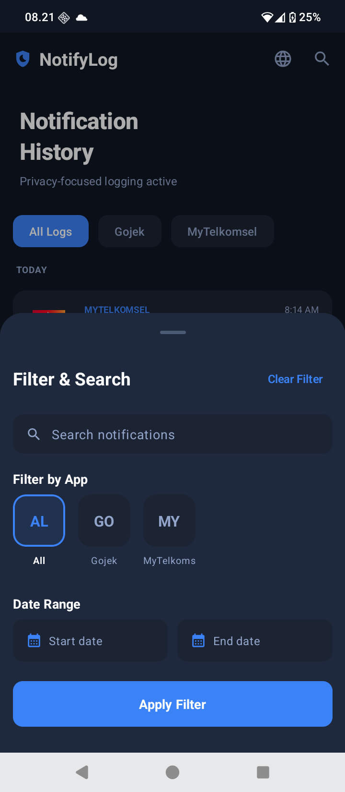
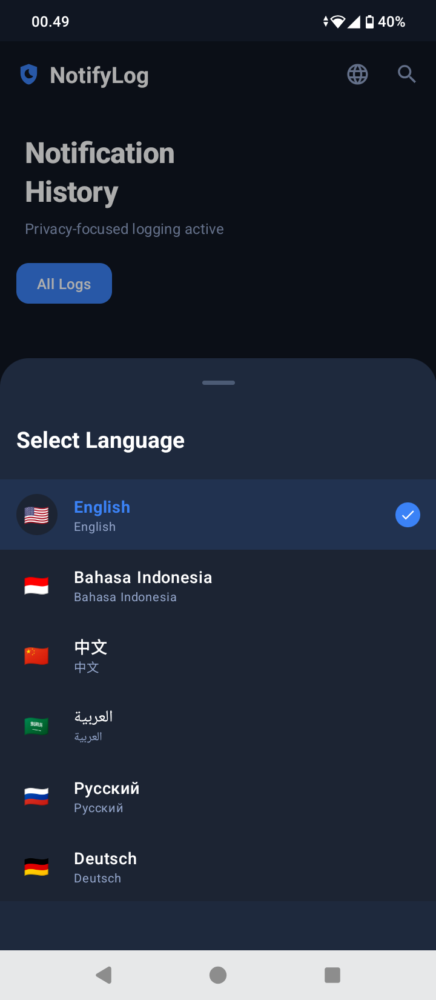
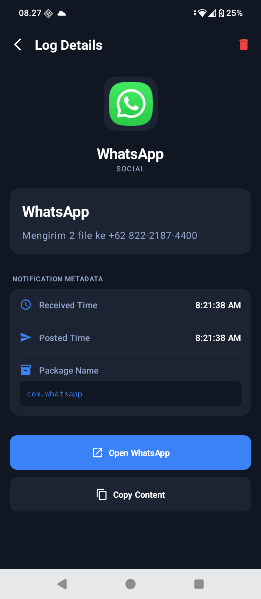

# NotifyLog

NotifyLog records device notifications and stores them locally for personal reference. The app is designed with an offline-first approach and does not transmit notification contents to external services.

---

## Key features
- Capture incoming notifications via NotificationListenerService
- Store logs in SQLite using Room
- Search and filter the history by app and date range
- View details for each notification (title, content, timestamps, package, channel)
- Onboarding flow to request notification access
- Settings: enable/disable logging, ignore system apps, and auto-delete retention

## App information
- Application ID: `id.onyet.app.notifylog`
- Minimum SDK: 26
- Target SDK: 34
- Architecture: Room (Entity, DAO, Repository)
- UI: Jetpack Compose + Material3

## Project structure
- `app/src/main/java/id/onyet/app/notifylog/` — application code
  - `data/` — database, repository, preferences
  - `service/` — `NotificationLogService.kt`
  - `ui/` — screens, navigation, theme
  - `util/` — helper utilities
- `blueprint/` — design assets and reference screens

## Build and run
1. Open the project in Android Studio and sync Gradle.
2. Or use the command line:
   - Build debug APK: `./gradlew assembleDebug`
   - Install debug APK: `adb install -r app/build/outputs/apk/debug/app-debug.apk`
3. Ensure the Android SDK is configured in `local.properties` (`sdk.dir`).

## Permissions and testing
- Enable Notification Access in system settings: `Settings → Notification access → NotifyLog`.
- The onboarding screen provides a shortcut to the system setting.
- To test: enable notification access and generate notifications from other apps; logged notifications will appear in NotifyLog.

## Assets and design
- App icons and drawables are available in `blueprint/icons/android/res` and copied to `app/src/main/res/`.

## Screenshots
Preview images are located in `assets/screenshot/`.

|  |  |  |
|---|---|---|
|  |  |  |

Use the original files in `assets/screenshot/` for high-resolution images.

## Play Store and privacy
- All notification data is stored locally and is not transmitted to external servers.
- Add a privacy policy before publishing to comply with Play Store requirements.

## Development notes
- Use the repository and DAO in `NotifyLogApp` for test data.
- Consider adding unit and instrumentation tests for database and UI flows.

## Author
Dian Mukti Wibowo — <onyetcorp@gmail.com>

## License
This project is licensed under the MIT License. See the `LICENSE` file for details.
